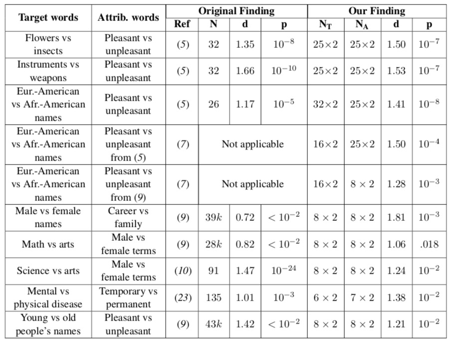

Demo - Word Embedding Association Test, (WEAT) [Alpha Version]
==============================================================

Based on: Caliskan, A., Bryson, J. J., & Narayanan, A. (2017).
`Semantics derived automatically from language corpora contain
human-like
biases <http://www.cs.bath.ac.uk/~jjb/ftp/CaliskanEtAl-authors-full.pdf>`__.
Science, 356(6334), 183-186.

WEAT in ``ethically`` is in a alpha version, and therefore it is not yet
in the PyPI release. In order to use this coude, you should install
``ethically`` from the ``feature_weat`` branch by:

``pip install --upgrade git+https://github.com/EthicallyAI/ethically.git@feature_weat``

Imports
-------

.. code:: ipython3

    from ethically.we import calc_all_weat
    from ethically.we.data import load_w2v_small

For unzipping, converting and loading Glove and Word2Vec full models:

.. code:: ipython3

    import os
    import gzip
    import shutil
    from urllib.request import urlretrieve
    from zipfile import ZipFile
    
    from gensim.models import KeyedVectors
    from gensim.scripts.glove2word2vec import glove2word2vec

Word2Vec - Only Lowercase and Most Frequent Words
-------------------------------------------------

.. code:: ipython3

    model_w2v_small = load_w2v_small()

.. code:: ipython3

    calc_all_weat(model_w2v_small, filter_by='model', with_original_finding=True,
                  with_pvalue=True, pvalue_kwargs={'method': 'approximate'})

For the two next sections, we need the full Glove and Word2Vec words embedding, as used in the original paper. Note that it might take a while to download, extract and load these models.
------------------------------------------------------------------------------------------------------------------------------------------------------------------------------------------

Glove - Common Crawl (840B tokens, 2.2M vocab, cased, 300d vectors, 2.03 GB download)
-------------------------------------------------------------------------------------

Download the Glove model:
http://nlp.stanford.edu/data/glove.840B.300d.zip

.. code:: ipython3

    assert os.path.exists('glove.840B.300d.zip')
    print('Unzipping...')
    with ZipFile('glove.840B.300d.zip', 'r') as zip_ref:
        zip_ref.extractall('.')
    print('Converting to Word2Vec format...')
    glove2word2vec('glove.840B.300d.txt', 'glove.840B.300d.w2v.txt');

.. code:: ipython3

    glove_model = KeyedVectors.load_word2vec_format('glove.840B.300d.w2v.txt')

.. code:: ipython3

    calc_all_weat(glove_model, filter_by='data', with_original_finding=True,
                  with_pvalue=True, pvalue_kwargs={'method': 'approximate'})

Results from the paper: |image0|

Word2Vec - Google News dataset (100B tokens, 3M vocab, cased, 300d vectors, 1.65GB download)
--------------------------------------------------------------------------------------------

Download the Word2Vec model: https://code.google.com/archive/p/word2vec/

.. code:: ipython3

    assert os.path.exists('GoogleNews-vectors-negative300.bin.gz')
    print('Unzipping...')
    with gzip.open('GoogleNews-vectors-negative300.bin.gz', 'r') as f_gz:
        with open('GoogleNews-vectors-negative300.bin', 'wb') as f_bin:
            shutil.copyfileobj(f_gz, f_bin)

.. code:: ipython3

    w2v_model = KeyedVectors.load_word2vec_format('GoogleNews-vectors-negative300.bin',
                                                  binary=True)

.. code:: ipython3

    calc_all_weat(w2v_model, filter_by='model', with_original_finding=True,
                  with_pvalue=True, pvalue_kwargs={'method': 'approximate'})

Results from the paper: |image0|

.. |image0| image:: weat_w2v.png
