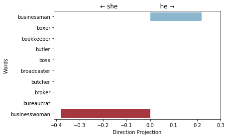
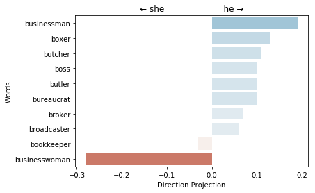
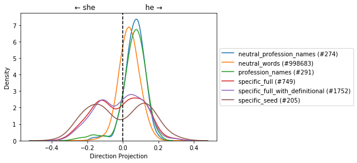

Tutorial - Gender Bias in Words Embedding
=========================================

Based on: Bolukbasi Tolga, Kai-Wei Chang, James Y. Zou, Venkatesh
Saligrama, and Adam T. Kalai. `Man is to computer programmer as woman is
to homemaker? debiasing word
embeddings <https://arxiv.org/abs/1607.06520>`__. NIPS 2016.

Imports
-------

.. code:: ipython3

    from gensim import downloader
    from gensim.models import KeyedVectors
    
    from ethically.we import GenderBiasWE

Google’s Word2Vec
-----------------

Download and load word2vec full model (might take few minutes)
~~~~~~~~~~~~~~~~~~~~~~~~~~~~~~~~~~~~~~~~~~~~~~~~~~~~~~~~~~~~~~

.. code:: ipython3

    w2v_path = downloader.load('word2vec-google-news-300', return_path=True)
    print(w2v_path)
    w2v_model = KeyedVectors.load_word2vec_format(w2v_path, binary=True)

.. parsed-literal::

    /home/users/shlohod/gensim-data/word2vec-google-news-300/word2vec-google-news-300.gz

Create Gender Bias Words Embedding
~~~~~~~~~~~~~~~~~~~~~~~~~~~~~~~~~~

.. code:: ipython3

    w2v_gender_bias_we = GenderBiasWE(w2v_model, only_lower=False, verbose=True)

.. parsed-literal::

    Identify direction using pca method...
      Principal Component    Explained Variance Ratio
    ---------------------  --------------------------
                        1                  0.605292
                        2                  0.127255
                        3                  0.099281
                        4                  0.0483466
                        5                  0.0406355
                        6                  0.0252729
                        7                  0.0232224
                        8                  0.0123879
                        9                  0.00996098
                       10                  0.00834613

Evaluate the Words Embedding on (1) words pair and (2) analogies tasks
~~~~~~~~~~~~~~~~~~~~~~~~~~~~~~~~~~~~~~~~~~~~~~~~~~~~~~~~~~~~~~~~~~~~~~

.. code:: ipython3

    w2v_gender_bias_we.evaluate_words_embedding()

.. parsed-literal::

    Evaluate word pairs...
    Evaluate analogies...
    
    From Gensim
    
    ------------------------------
    
    Word Pairs Result - WordSimilarity-353:
    ~~~~~~~~~~~~~~~~~~~~~~~~~~~~~~~~~~~~~~~
    Pearson correlation coefficient: (0.6238773444802619, 1.7963251834702263e-39)
    Spearman rank-order correlation coefficientbetween the similarities from the datasetand the similarities produced by the model itself: SpearmanrResult(correlation=0.6589215888009288, pvalue=2.5346056459149263e-45)
    Ratio of pairs with unknown words: 0.0
    
    ------------------------------
    
    Analogies Result
    ~~~~~~~~~~~~~~~~
    Overall evaluation score: 0.7401448525607863

Calculate direct gender bias (section 5.2 in the article)
~~~~~~~~~~~~~~~~~~~~~~~~~~~~~~~~~~~~~~~~~~~~~~~~~~~~~~~~~

.. code:: ipython3

    w2v_gender_bias_we.calc_direct_bias()

.. parsed-literal::

    0.07307904249481942

Plot the projection of different professions on the gender direction
~~~~~~~~~~~~~~~~~~~~~~~~~~~~~~~~~~~~~~~~~~~~~~~~~~~~~~~~~~~~~~~~~~~~

.. code:: ipython3

    # _.data API will change in the future
    sample_profession_name = w2v_gender_bias_we._data['profession_names'][40:50]
    w2v_gender_bias_we.plot_projection_scores(sample_profession_name);

.. image:: ethically-demo-gender-bias-words-embedding_files/ethically-demo-gender-bias-words-embedding_13_0.png

Plot the distribution of projections of the word groups that are being used for the auditing and adjusting the model
~~~~~~~~~~~~~~~~~~~~~~~~~~~~~~~~~~~~~~~~~~~~~~~~~~~~~~~~~~~~~~~~~~~~~~~~~~~~~~~~~~~~~~~~~~~~~~~~~~~~~~~~~~~~~~~~~~~~

1. **profession_name** - List of profession names, neutral and gender
   spcific.
2. **neutral_profession_name** - List of only neutral profession names.
3. **specific_seed** - Seed list of gender specific words.
4. **specific_full** - List of the learned specifc gender over all the
   vocabulary.
5. **specific_full_with_definitional** - **specific_full** with the
   words that were used to define the gender direction.
6. **neutral_words** - List of all the words in the vocabulary that are
   not part of **specific_full_with_definitional**.

.. code:: ipython3

    w2v_gender_bias_we.plot_dist_projections_on_direction()

.. image:: ethically-demo-gender-bias-words-embedding_files/ethically-demo-gender-bias-words-embedding_15_0.png

Preform hard-debiasing (section 6 in the article)
~~~~~~~~~~~~~~~~~~~~~~~~~~~~~~~~~~~~~~~~~~~~~~~~~

.. code:: ipython3

    w2v_gender_bias_we.debias('hard')

.. parsed-literal::

    Neutralize...

.. parsed-literal::

    100%|██████████| 2997984/2997984 [02:22<00:00, 21025.63it/s]

.. parsed-literal::

    Equalize...

Now our model is gender debiased, let’s check what changed…
-----------------------------------------------------------

Evaluate the debaised model
~~~~~~~~~~~~~~~~~~~~~~~~~~~

.. code:: ipython3

    w2v_gender_bias_we.evaluate_words_embedding()

.. parsed-literal::

    Evaluate word pairs...
    Evaluate analogies...
    
    From Gensim
    
    ------------------------------
    
    Word Pairs Result - WordSimilarity-353:
    ~~~~~~~~~~~~~~~~~~~~~~~~~~~~~~~~~~~~~~~
    Pearson correlation coefficient: (0.6229075431672366, 2.5455943669404915e-39)
    Spearman rank-order correlation coefficientbetween the similarities from the datasetand the similarities produced by the model itself: SpearmanrResult(correlation=0.6571345149468917, pvalue=5.26293047396376e-45)
    Ratio of pairs with unknown words: 0.0
    
    ------------------------------
    
    Analogies Result
    ~~~~~~~~~~~~~~~~
    Overall evaluation score: 0.7372995344024832

The evaluation of the words embedding did not change so much because of
the debiasing:

+--------+-------------+-----------+
| Debias | Words Pairs | Analogies |
+========+=============+===========+
| Before | 0.6238      | 0.7401    |
+--------+-------------+-----------+
| After  | 0.6229      | 0.7372    |
+--------+-------------+-----------+

Calculate direct gender bias (section 5.2 in the article)
~~~~~~~~~~~~~~~~~~~~~~~~~~~~~~~~~~~~~~~~~~~~~~~~~~~~~~~~~

.. code:: ipython3

    w2v_gender_bias_we.calc_direct_bias()

.. parsed-literal::

    1.7964246601064155e-09

The words embedding is not biased any more (in the professions sense).

Plot the projection of different professions on the gender direction
~~~~~~~~~~~~~~~~~~~~~~~~~~~~~~~~~~~~~~~~~~~~~~~~~~~~~~~~~~~~~~~~~~~~

.. code:: ipython3

    w2v_gender_bias_we.plot_projection_scores(sample_profession_name);

Let’s do the same for Facebook’s FastText words embedding
---------------------------------------------------------

.. code:: ipython3

    fasttext_path = downloader.load('fasttext-wiki-news-subwords-300', return_path=True)
    print(fasttext_path)
    fasttext_model = KeyedVectors.load_word2vec_format(fasttext_path)
    
    fasttext_gender_bias_we = GenderBiasWE(fasttext_model, only_lower=False, verbose=True)

.. parsed-literal::

    /home/users/shlohod/gensim-data/fasttext-wiki-news-subwords-300/fasttext-wiki-news-subwords-300.gz
    Identify direction using pca method...
      Principal Component    Explained Variance Ratio
    ---------------------  --------------------------
                        1                   0.531331
                        2                   0.18376
                        3                   0.089777
                        4                   0.0517856
                        5                   0.0407739
                        6                   0.0328988
                        7                   0.0223339
                        8                   0.0193495
                        9                   0.0143259
                       10                   0.0136648

.. code:: ipython3

    fasttext_gender_bias_we.evaluate_words_embedding()

.. parsed-literal::

    Evaluate word pairs...
    Evaluate analogies...
    
    From Gensim
    
    ------------------------------
    
    Word Pairs Result - WordSimilarity-353:
    ~~~~~~~~~~~~~~~~~~~~~~~~~~~~~~~~~~~~~~~
    Pearson correlation coefficient: (0.6064465441010313, 7.884629612673178e-37)
    Spearman rank-order correlation coefficientbetween the similarities from the datasetand the similarities produced by the model itself: SpearmanrResult(correlation=0.5959362724389288, pvalue=2.5867291082202643e-35)
    Ratio of pairs with unknown words: 0.0
    
    ------------------------------
    
    Analogies Result
    ~~~~~~~~~~~~~~~~
    Overall evaluation score: 0.8827876424099353

.. code:: ipython3

    fasttext_gender_bias_we.calc_direct_bias()

.. parsed-literal::

    0.07633256240142092

.. code:: ipython3

    fasttext_gender_bias_we.plot_projection_scores(sample_profession_name);

.. code:: ipython3

    fasttext_gender_bias_we.plot_dist_projections_on_direction()

.. code:: ipython3

    fasttext_gender_bias_we.debias('hard')

.. parsed-literal::

    Neutralize...

.. parsed-literal::

    100%|██████████| 998683/998683 [00:45<00:00, 22188.27it/s]

.. parsed-literal::

    Equalize...

.. code:: ipython3

    fasttext_gender_bias_we.evaluate_words_embedding()

.. parsed-literal::

    Evaluate word pairs...
    Evaluate analogies...
    
    From Gensim
    
    ------------------------------
    
    Word Pairs Result - WordSimilarity-353:
    ~~~~~~~~~~~~~~~~~~~~~~~~~~~~~~~~~~~~~~~
    Pearson correlation coefficient: (0.6085795068154352, 3.821217955215411e-37)
    Spearman rank-order correlation coefficientbetween the similarities from the datasetand the similarities produced by the model itself: SpearmanrResult(correlation=0.598081825041795, pvalue=1.2817937025363148e-35)
    Ratio of pairs with unknown words: 0.0
    
    ------------------------------
    
    Analogies Result
    ~~~~~~~~~~~~~~~~
    Overall evaluation score: 0.8821718156625269

.. code:: ipython3

    fasttext_gender_bias_we.calc_direct_bias()

.. parsed-literal::

    1.4306556940946813e-09

.. code:: ipython3

    fasttext_gender_bias_we.plot_projection_scores(sample_profession_name);

.. image:: ethically-demo-gender-bias-words-embedding_files/ethically-demo-gender-bias-words-embedding_36_0.png

